# Custom Cover Position

🇫🇷 **Français** · 🇬🇧 [English](README.md)

**Donnez une position à vos volets, stores, portails… qui ne savent pas où ils en sont.**

Custom Cover Position est une intégration Home Assistant qui **estime l'état et la position des entités « cover »** à partir du temps qu'elles mettent à s'ouvrir et à se fermer et permet de configurer simplement des positions prédéfinies. Elle est notamment utilisable pour des volets qui ne renvoient pas leur position, comme les volets roulants Somfy RTS, par exemple.

Elle s'inspire de deux projets : [cover_rf_time_based](https://github.com/davidramosweb/home-assistant-custom-components-cover-time-based) de davidramosweb, pour estimer la position d'une entité « cover » d'après le temps écoulé, et [ha-cover-time-based](https://github.com/Sese-Schneider/ha-cover-time-based) de Sese-Schneider (licence MIT), pour une configuration entièrement faite par l'interface, sans fichier YAML.

**[Pourquoi](#pourquoi)** · **[Installation](#installation)** · **[Configuration](#configuration)** · **[Entités et noms](#entités-et-noms)** · **[Groupes](#groupes-de-volets)** · **[Recaler la position](#recaler-la-position)** · **[Dépannage](#dépannage)** · **[Besoin d'aide ou signaler un bug](#besoin-daide-ou-signaler-un-bug)** · **[Limites](#limites)** · **[Langues](#langues-et-documentation)**

## Pourquoi

Un volet piloté par une télécommande radio (Somfy RTS, par exemple) reçoit des ordres mais **ne renvoie rien** : Home Assistant ne sait pas s'il est ouvert, fermé, ou s'il occupe une position intermédiaire. Son état reste « inconnu », et l'on ne peut pas lui demander de se fermer ou s'ouvrir de « 40 % ».

Cette intégration crée, à côté de l'entité existante (l'**entité source**), une **entité personnalisée** qui :

- **connaît son état** : ouvert, fermé, en cours d'ouverture, en cours de fermeture ;
- **calcule sa position** (de 0 % à 100 %) d'après le temps écoulé depuis la dernière commande ;
- **va à la position demandée** : elle envoie l'ouverture ou la fermeture, puis l'arrêt à l'instant calculé ;
- **se lie à l'appareil de l'entité source** : pas de doublon dans la liste de vos appareils, pas de création manuelle dans les Entrées ou les fichiers configuration.yaml et templates.yaml ;
- **reprend le nom et l'identifiant de l'entité source** : vos scripts et automatisations continuent de fonctionner sans modification ;
- **commande plusieurs volets d'un coup** avec des [groupes](#groupes-de-volets), chaque volet gardant sa position ;
- **crée des boutons de positions prédéfinies** (« Pare-soleil », « Chaleur »…) et peut **désactiver les entités de l'appareil source** qui feraient perdre le suivi de position.

La position est une **estimation** : elle suppose que le volet met toujours le même temps à se fermer ou s'ouvrir. Voir [Limites](#limites).

## Compatibilité

- **Home Assistant 2026.9 ou plus récent.** L'intégration est testée avec la version 2026.9.4.
- **Toute entité `cover` qui sait s'ouvrir, se fermer et s'arrêter** : volets roulants, stores, stores bannes, rideaux, portails, portes de garage, fenêtres…
- Exemple d'usage : des volets Somfy RTS commandés par Home Assistant, via l'intégration qui les fournit (Overkiz, par exemple).

## Installation

<b>Avec HACS (recommandé)</b>

 

Cette méthode vous permet de recevoir les mises à jour directement dans HACS.

1. Dans HACS, cliquez sur les trois points en haut à droite, puis sur **Dépôts personnalisés**.
2. Collez l'adresse du dépôt : `https://github.com/Faufyzen/ha-custom-cover-position`
3. Choisissez le type **Intégration**, puis cliquez sur **Ajouter**.
4. Cherchez **Custom Cover Position** dans HACS et cliquez sur **Télécharger**.
5. **Redémarrez Home Assistant**.

<b>Sans HACS (manuelle)</b>

 

1. Téléchargez ce dépôt (bouton vert **Code**, puis **Download ZIP**) et décompressez-le.
2. Copiez le dossier `custom_components/timed_cover` dans le dossier `config/custom_components` de votre configuration Home Assistant.
3. **Redémarrez Home Assistant.**

L'icône de l'intégration n'apparaît qu'après un redémarrage, et votre navigateur peut garder l'ancienne image en cache : un rechargement forcé de la page (⌘⇧R ou Ctrl+Maj+R) règle cela.

### Désinstallation

Supprimez d'abord chaque entité personnalisée (Paramètres → Appareils et services → Custom Cover Position → menu ⋮ de l'entité → **Supprimer**) : l'intégration remet alors les noms, la visibilité et les entités de l'appareil source dans leur état de départ. Supprimez ensuite l'intégration dans HACS (ou le dossier `custom_components/timed_cover`) et redémarrez Home Assistant.

## Configuration

Tout se règle dans une fenêtre de configuration, en deux étapes.

1. Allez dans **Paramètres → Appareils et services**.
2. La première fois, cliquez sur **Ajouter une intégration** et cherchez **Custom Cover Position**. Ensuite, la carte de l'intégration apparaît : son bouton **Ajouter une entité ou un groupe** suffit. Un menu propose alors **Entité personnalisée** (ce qui suit) ou **Groupe d'entités personnalisées** (voir [Groupes de volets](#groupes-de-volets)) : choisissez la première.

  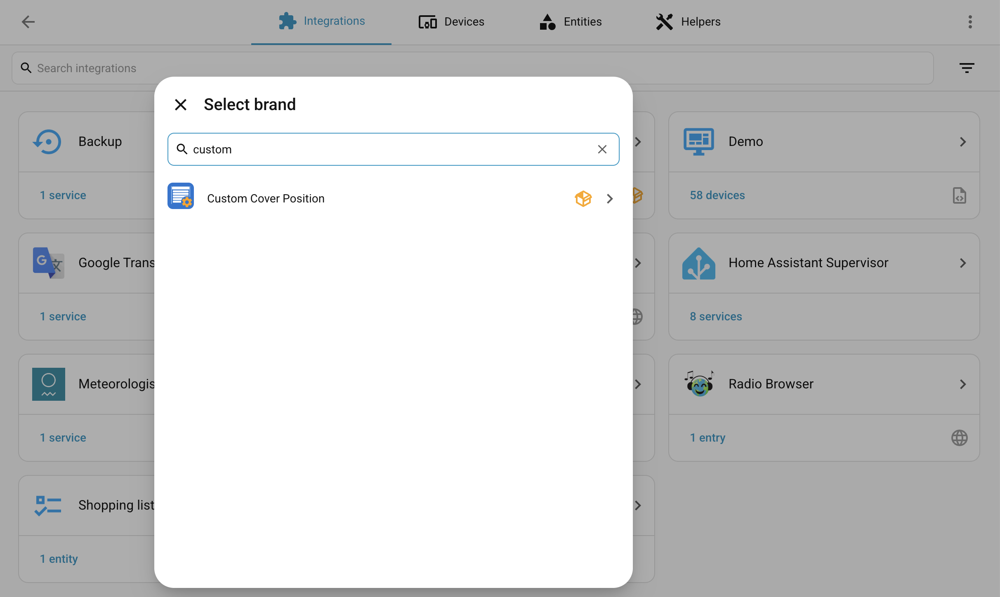

3. **Étape 1 : sélectionnez l'entité source**, celle dont vous voulez estimer la position (par exemple `cover.volet_chambre`). Elle doit déjà exister dans Home Assistant.

<table align="center">
  <tr>
    <td>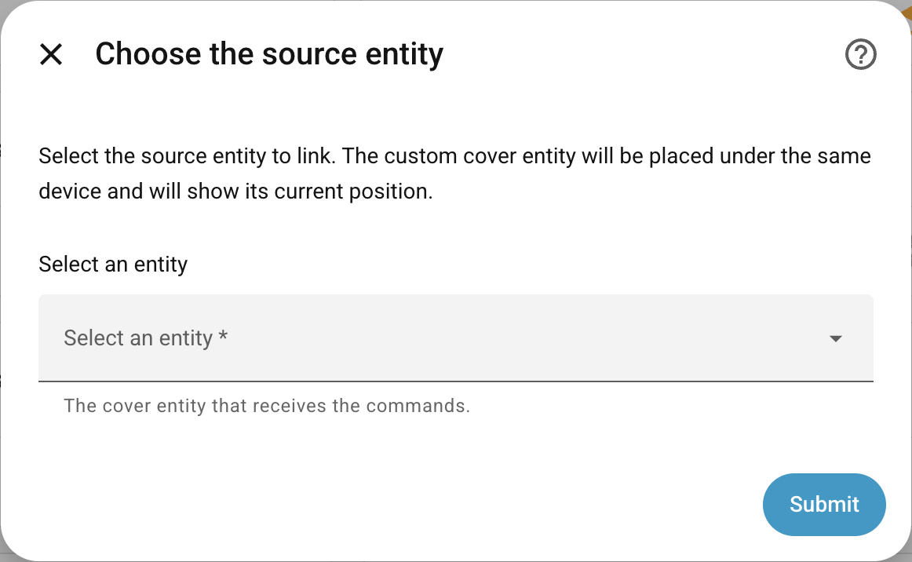</td>
    <td>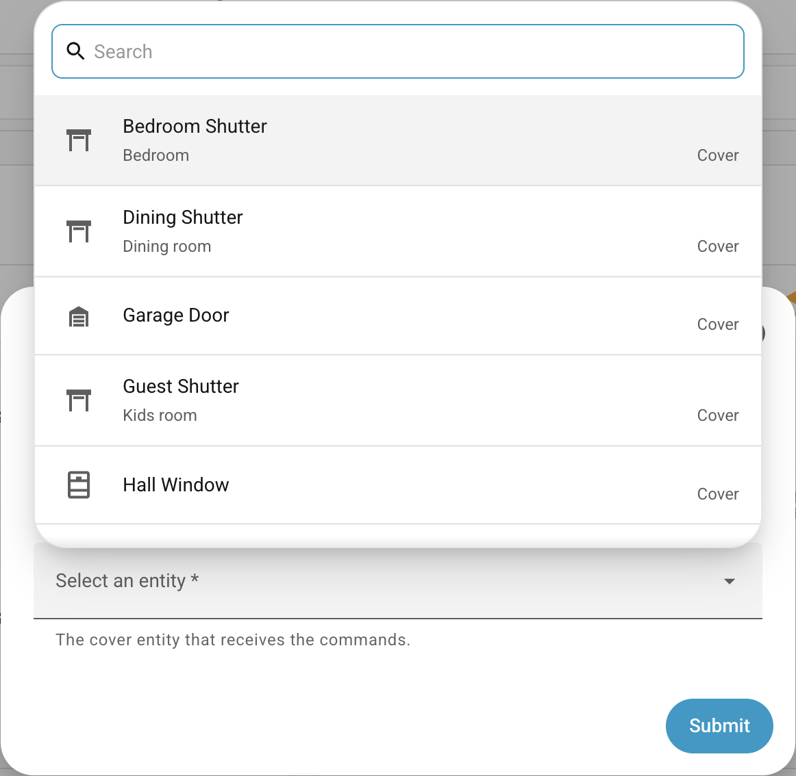</td>
  </tr>
</table>

4. **Étape 2 : remplissez les réglages** du tableau ci-dessous, puis validez.

| Réglage | Rôle |
| --- | --- |
| Nom de l'entité | Le nom affiché. L'identifiant en est déduit : « Volet Chambre » donne `cover.volet_chambre`. |
| Délai d'ouverture, Délai de fermeture | Durée en secondes d'un trajet complet (voir [Mesurer les délais](#mesurer-les-délais)). |
| Envoyer « stop » aux extrémités | Envoie une commande d'arrêt même après une ouverture ou une fermeture complète. À laisser désactivé, sauf si votre volet ne s'arrête pas tout seul en fin de course. |
| Classe d'appareil | Le type d'équipement (volet, store, store vénitien, auvent, rideau, porte, portail, garage, clapet, fenêtre) : il détermine l'icône. |
| Masquer l'entité source | L'entité source disparaît des écrans automatiques de Home Assistant, pour ne pas l'utiliser par erreur. Voir [Entités et noms](#entités-et-noms). Activé par défaut. |
| Désactiver les autres entités de l'appareil source | Désactive tout sauf l'entité source, par exemple les boutons « My Position ». Voir [Entités et noms](#entités-et-noms). Désactivé par défaut. |
| Positions prédéfinies | Une liste de boutons qui amènent le volet à un pourcentage choisi. Voir [Positions prédéfinies](#positions-prédéfinies). |
| Reprendre le nom et l'identifiant de l'entité source | L'entité personnalisée prend le nom et l'identifiant de l'entité source, qui est renommée. Voir [Entités et noms](#entités-et-noms). Activé par défaut. |
| Suffixe pour l'entité source | Ajouté au nom et à l'identifiant de l'entité source quand elle est renommée. « source » par défaut. |

<table align="center">
  <tr>
    <td>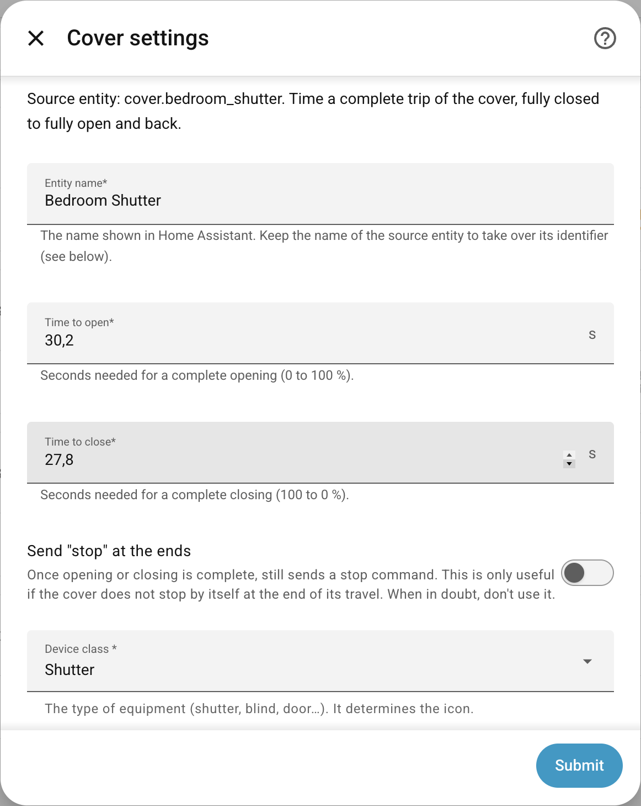</td>
    <td>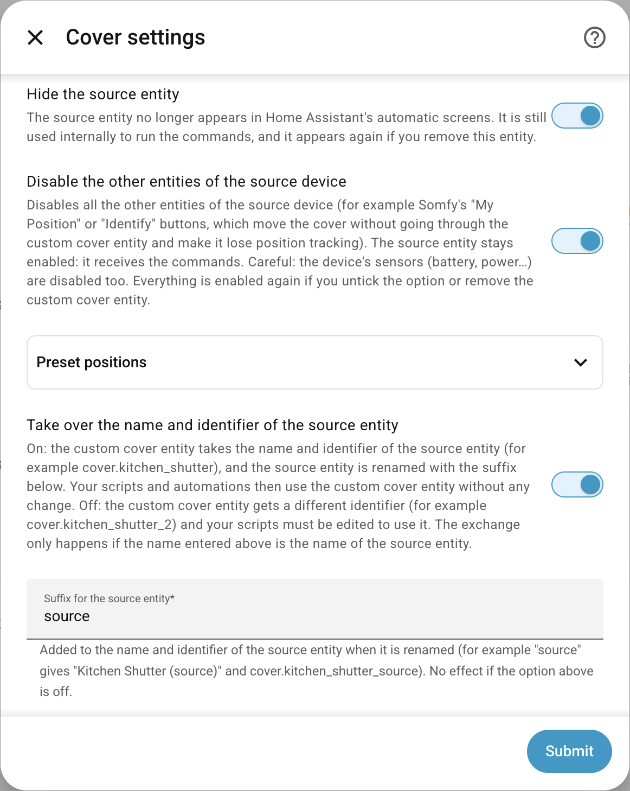</td>
  </tr>
</table>

### Mesurer les délais

Les deux délais sont la seule chose que l'intégration ne peut pas deviner. Chronométrez, avec la télécommande ou l'application d'origine :

1. **Délai d'ouverture** : le volet est fermé ; lancez l'ouverture complète et notez le temps jusqu'à l'arrêt.
2. **Délai de fermeture** : le volet est ouvert ; lancez la fermeture complète et notez le temps.

Les deux durées sont souvent différentes (un volet monte plus lentement qu'il ne descend). Pour affiner plus tard, demandez 50 % : si le volet s'arrête trop haut ou trop bas, corrigez le délai de quelques dixièmes de seconde.

### Positions prédéfinies

Une position prédéfinie est un **bouton** qui amène le volet à un pourcentage choisi. Les boutons d'origine comme « My Position » (Somfy) commandent le volet **sans passer par l'entité personnalisée** : elle perd alors le suivi de sa position. Les boutons de cette intégration, eux, passent par l'entité personnalisée, donc la position reste juste.

Dans le bloc **Positions prédéfinies**, cliquez sur **Ajouter**, puis donnez un **nom** (« Pare-soleil »), une **position** de 0 à 100 % et, si vous le voulez, une **icône**. Chaque ligne crée un bouton « <nom de l'entité> <nom de la position> » sous le même appareil, par exemple « Volet Chambre Pare-soleil ». On peut créer **8 positions au maximum**.

<table align="center">
  <tr>
    <td>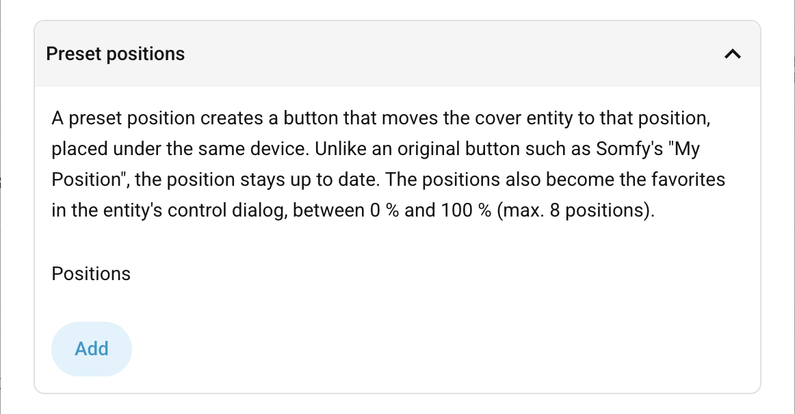</td>
    <td>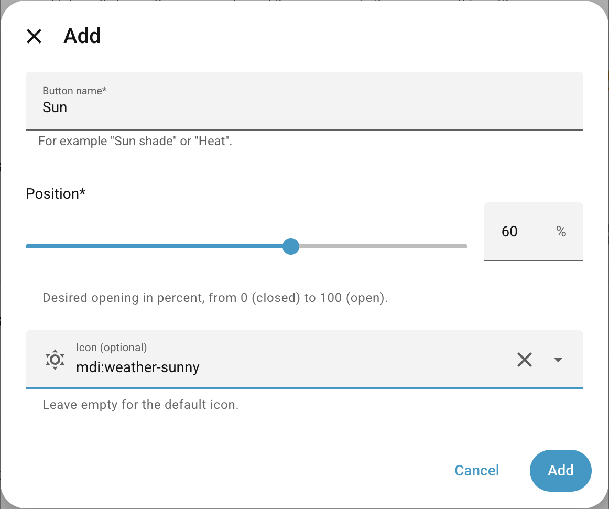</td>
    <td>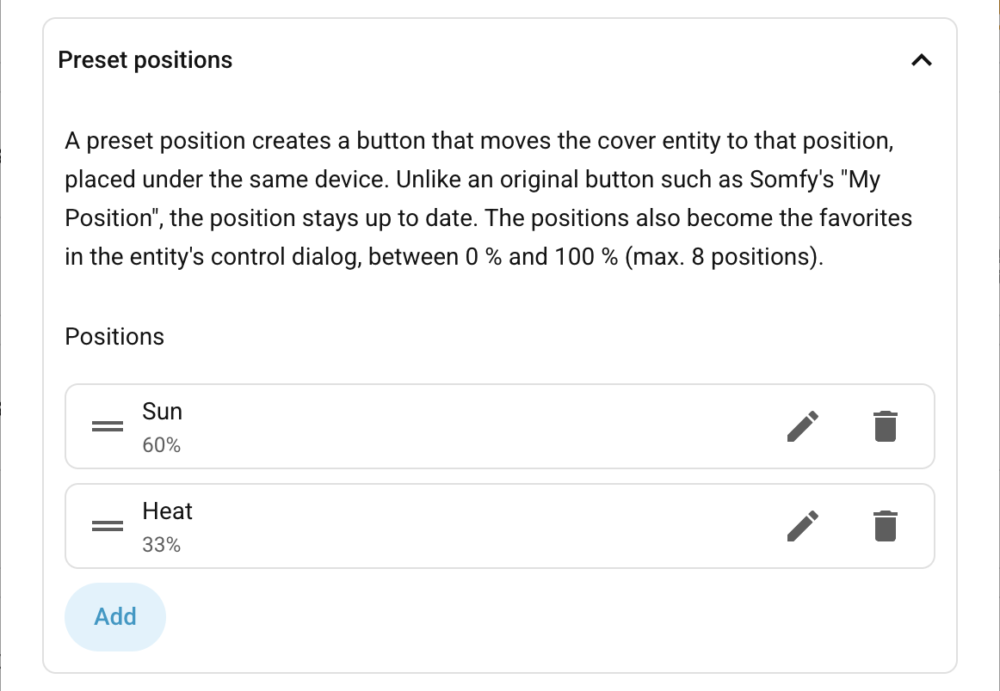</td>
  </tr>
</table>

Cela influe sur **les favoris de la fenêtre de l'entité.** Quand vous cliquez sur une entité, Home Assistant affiche des pastilles de position sous le curseur (« 0 % », « 25 % », « 75 % », « 100 % » par défaut). Avec des positions prédéfinies, l'intégration les remplace par **0 %, vos positions, 100 %** : un bouton « Chaleur » à 33 % et un bouton « Soleil » à 60 % donnent 0 %, 33 %, 60 % et 100 %, comme sur l'image ci-dessous. Sans position prédéfinie, les pastilles par défaut restent. Si vous les modifiez à la main (menu ⋮ → Modifier les favoris), votre choix est respecté jusqu'au prochain changement de la liste.

<table align="center">
  <tr>
    <td align="center"><b>Avant</b> 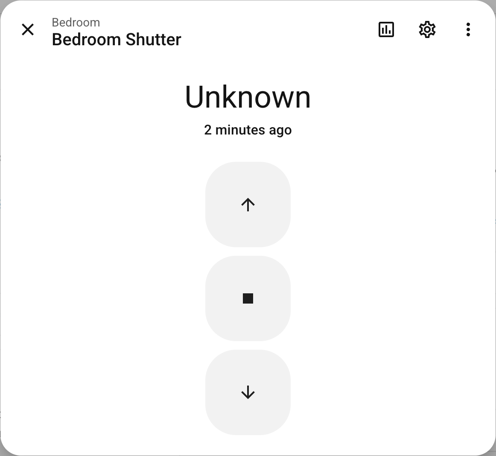</td>
    <td align="center"><b>ou</b> 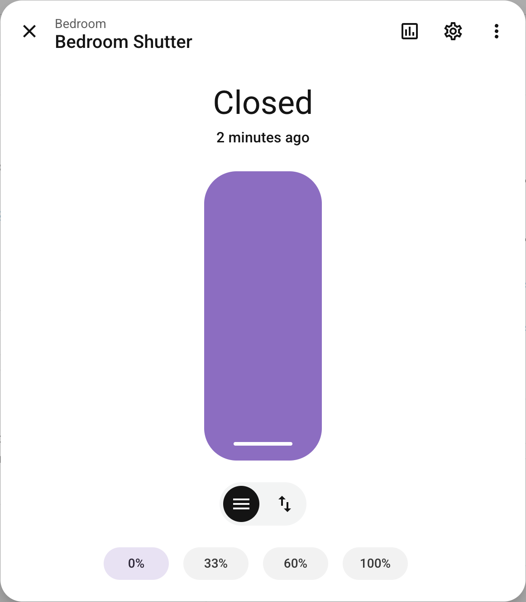</td>
  </tr>
</table>

Une fois validé, un message confirme la création de l'entité.

  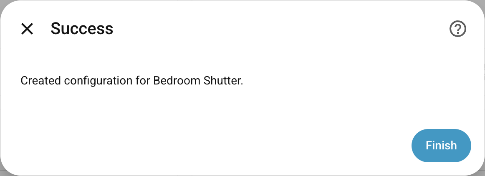

### Modifier un réglage plus tard

Chaque réglage reste modifiable (sauf le nom, l'échange des noms et le suffixe, qui ne se choisissent qu'à la création) : positions à ajouter, modifier ou supprimer, délais, options. Les réglages se trouvent dans **l'intégration Custom Cover Position**, et **non** dans l'intégration de l'appareil source (Overkiz, par exemple), même si l'entité personnalisée est rattachée à l'appareil de l'entité source :

1. **Paramètres → Appareils et services**, carte **Custom Cover Position**.
2. Cliquez sur la **roue dentée** de l'entité concernée.
3. Modifiez ce que vous voulez et validez : la position actuelle est conservée.

  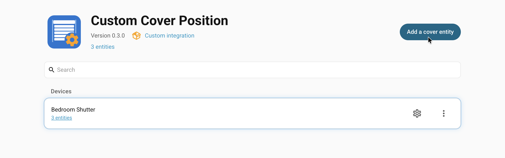

Chaque position prédéfinie a son crayon et sa corbeille ; supprimer une ligne supprime son bouton.

## Entités et noms

### Ce que l'intégration crée

- **Une entité `cover`** (l'entité personnalisée), avec le nom et l'identifiant que vous avez choisis. Elle expose les attributs `travel_time_up` et `travel_time_down` (les délais, en secondes), `source_entity` (l'entité source) et, pendant un déplacement, `target_position`.
- **Un bouton par position prédéfinie.**

Elle est **indisponible** quand l'entité source l'est. L'état « inconnu » de l'entité source, normal pour des volets sans retour d'état, ne la rend pas indisponible. Au redémarrage de Home Assistant, la dernière position est restaurée.

### Échange des noms

L'entité source s'appelle souvent comme vous voulez nommer l'entité personnalisée (par exemple `cover.volet_chambre`). Par défaut, l'intégration propose de **reprendre le nom** de l'entité source :

- l'entité source est renommée avec le suffixe choisi : « Volet Chambre (source) », `cover.volet_chambre_source` ;
- l'entité personnalisée prend le nom et l'identifiant que portait l'entité source : `cover.volet_chambre`.

Vos scripts, automatisations et tableaux de bord qui utilisent déjà `cover.volet_chambre` utilisent donc l'entité personnalisée, **sans aucune modification** de votre part. L'échange n'a lieu que si vous laissez le nom de l'entité source qui apparaît par défaut dans le champ **Nom de l'entité** lors de la création de l'entité personnalisée. Si vous désactivez l'option, l'entité personnalisée reçoit un autre identifiant (`cover.volet_chambre_2`) et vos scripts devront être modifiés pour l'utiliser.

**À la suppression de l'entité personnalisée, tout est remis** : l'entité source retrouve son nom et son identifiant. Ce que vous avez changé depuis est respecté.

### Masquer et désactiver

- **Masquer l'entité source** la retire des écrans générés automatiquement, pour ne pas l'utiliser par erreur. Elle reste utilisée en interne pour envoyer les commandes, et elle reste proposée dans les listes de choix des scripts (Home Assistant ne permet pas de l'en retirer).
- **Désactiver les autres entités de l'appareil source** désactive tout sauf l'entité source, par exemple les boutons « My Position » ou « Identifier » d'une intégration Somfy. Attention : les **capteurs** de l'appareil (batterie, puissance…) sont désactivés aussi, c'est pourquoi l'option est désactivée par défaut. Tout est réactivé si vous la décochez ou si vous supprimez l'entité personnalisée.

La page de l'appareil, avant puis après : l'entité personnalisée, ses boutons de positions, l'entité source masquée et « My position » désactivé.

<table align="center">
  <tr>
    <td align="center"><b>Avant</b> 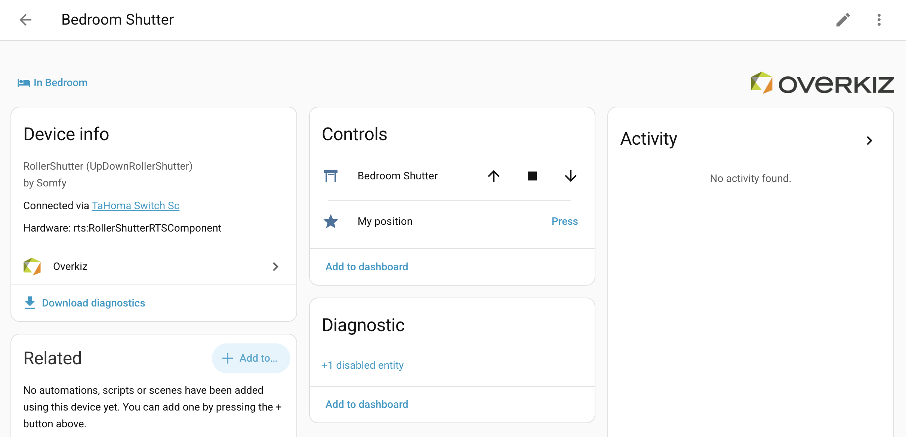</td>
    <td align="center"><b>Après</b> 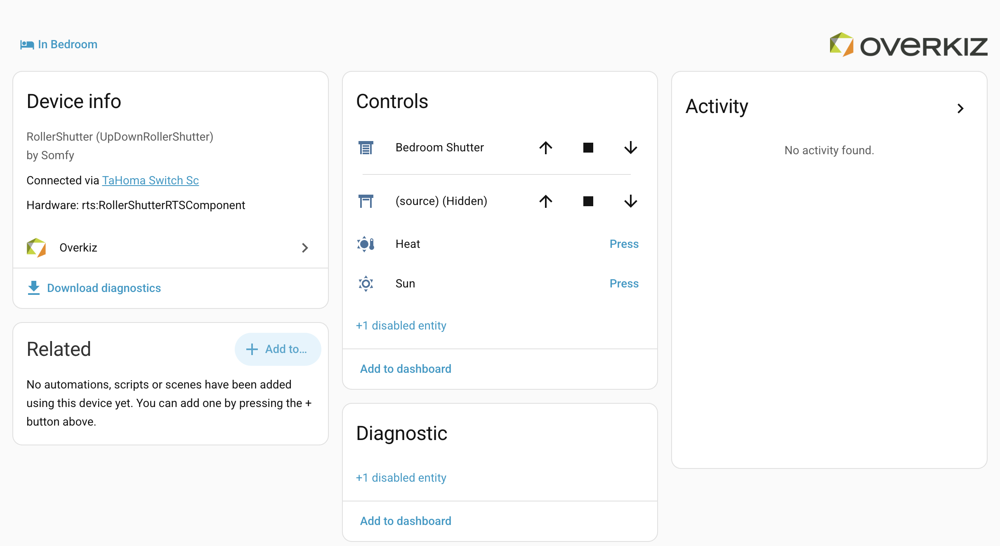</td>
  </tr>
</table>

## Groupes de volets

Un **groupe** commande plusieurs entités personnalisées **en même temps**, chacune gardant sa propre position estimée. C'est ce que vous feriez avec un script qui lance les ordres en parallèle (action `parallel:`), sans script à écrire ni à entretenir. Contrairement à un groupe natif de Home Assistant, il crée aussi des **boutons de positions prédéfinies communes** à ses volets.

### Créer un groupe

1. **Paramètres → Appareils et services**, carte **Custom Cover Position**, bouton **Ajouter une entité ou un groupe**.
2. Choisissez **Groupe d'entités personnalisées**.
3. Donnez un **nom** (« Volets RDC ») et choisissez **au moins deux entités personnalisées**. Les groupes ne sont pas proposés : un groupe ne contient pas d'autre groupe.

### Ce que crée un groupe

Sous un appareil du même nom que le groupe :

- **Une entité `cover`** : Ouvrir, Fermer, Arrêter et Aller à une position envoient le même ordre à tous les volets en même temps. Pour « 50 % », chaque volet part de **sa** position et va à 50 % : un volet ouvert, un volet fermé et un volet à moitié ouvert finissent tous à 50 %. La position affichée est la **moyenne** des volets (exacte quand ils sont tous au même endroit) ; le groupe est en mouvement tant qu'un volet bouge, et fermé quand tous le sont.
- **Un bouton par nom de position** trouvé chez les volets (« Soleil », « Chaleur »…), nommé « <nom du groupe> <nom de la position> ». Les noms sont comparés sans tenir compte des majuscules ni des accents. Appuyer sur le bouton amène **chaque volet qui a cette position à son propre pourcentage** (« Soleil » peut valoir 60 % pour l'un et 50 % pour l'autre) ; un volet qui ne l'a pas ne bouge pas. Le groupe garde le même nombre de boutons que de noms de position distincts.
- **L'action Recaler la position** appliquée au groupe recale tous les volets d'un coup.

Un volet **indisponible est ignoré** (un avertissement apparaît dans les journaux) ; si l'ordre échoue pour un volet disponible, les autres le reçoivent quand même et l'erreur nomme le volet fautif.

### Modifier un groupe

La **roue dentée** du groupe permet de changer la liste de ses volets (le nom ne se choisit qu'à la création). Les boutons suivent les positions des volets : ajouter ou renommer une position sur un volet crée ou retire le bouton du groupe. Supprimer un volet le retire de ses groupes ; supprimer un groupe ne touche pas à ses volets.

### À savoir : les ordres partent ensemble, pas forcément les moteurs

Le groupe envoie tous les ordres au même instant. Avec des volets radio Somfy RTS commandés par une box TaHoma (intégration Overkiz), la box émet les ordres radio **l'un après l'autre**, environ une seconde chacun (d'après des journaux de 7 volets) : les derniers volets démarrent donc quelques secondes après le premier, quoi que fasse l'intégration. Chaque volet démarre son décompte quand Overkiz accepte son ordre ; l'ordre d'arrêt suit le même chemin, ce qui devrait compenser le décalage sur la durée du trajet. Si vous constatez un écart de position entre volets d'un groupe, recalez-les (voir [Recaler la position](#recaler-la-position)).

## Recaler la position

La position est estimée : une commande faite avec la télécommande d'origine, à la main ou après une coupure de courant peut la faire **dériver**. Deux façons de la remettre d'équerre :

- **Demander une ouverture ou une fermeture complète** à l'entité personnalisée : la commande est toujours envoyée, même si la position estimée est déjà à l'extrémité, et la position est recalée à 0 % ou à 100 %.
- **Indiquer la position réelle sans faire bouger le volet** : dans **Paramètres → Outils → Actions**, choisissez l'action **Recaler la position** (Custom Cover Position), sélectionnez la cible (l'entité personnalisée concernée), saisissez la position réelle (entre 0 et 100) et cliquez sur **Effectuer une action**.

<table align="center">
  <tr>
    <td>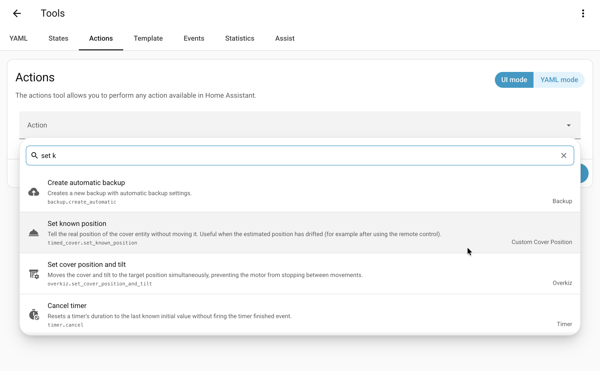</td>
    <td>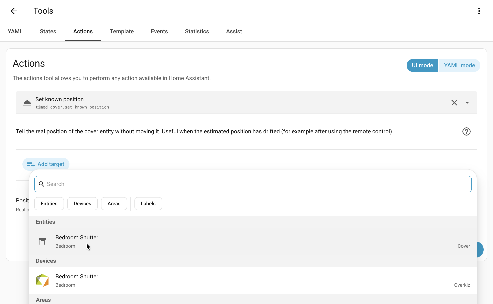</td>
  </tr>
</table>

<table align="center">
  <tr>
    <td>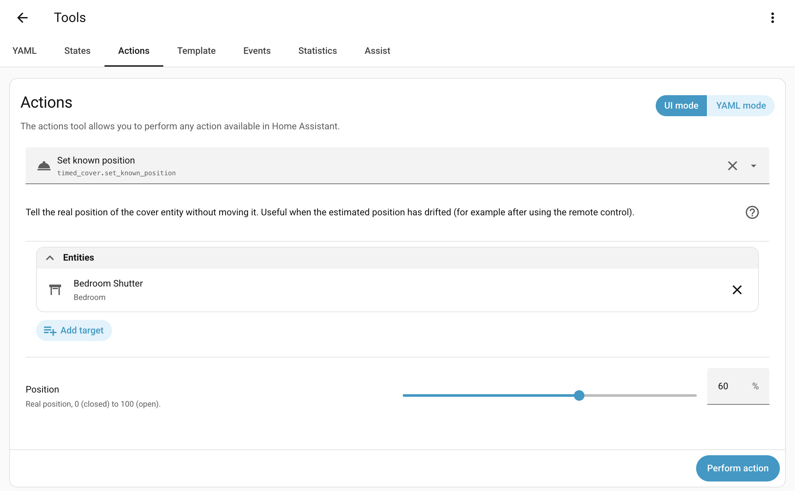</td>
    <td>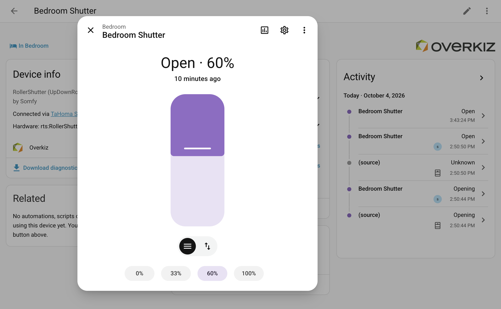</td>
  </tr>
</table>

## Dépannage

**La position ne correspond plus à la réalité.** C'est normal après une commande faite hors de Home Assistant. Voir [Recaler la position](#recaler-la-position).

**Le volet s'arrête trop haut ou trop bas quand je demande une position.** Les délais sont à ajuster : corrigez-les de quelques dixièmes de seconde dans les réglages (voir [Modifier un réglage plus tard](#modifier-un-réglage-plus-tard)).

**L'entité personnalisée est « Indisponible ».** L'entité source l'est : l'intégration qui la fournit est hors ligne.

**Je ne trouve pas le bouton « Ajouter une entité ou un groupe ».** La première fois, passez par **Ajouter une intégration** et cherchez « Custom Cover Position » ; le bouton existe ensuite sur la page de l'intégration.

**Mon entité personnalisée s'appelle `cover.xxx_2`.** L'identifiant voulu était déjà pris, par exemple par une ancienne entité qui reste dans Paramètres → Appareils et services → Entités. Supprimez ou renommez cette entité, puis recréez l'entité personnalisée. Le même cas arrive aux boutons de positions s'ils portent le nom d'anciens boutons de modèle.

**Je cherche les réglages dans l'intégration de mon appareil (Overkiz…).** Ils sont dans Custom Cover Position, pas dans l'intégration de l'appareil source. Voir [Modifier un réglage plus tard](#modifier-un-réglage-plus-tard).

**L'icône n'apparaît pas.** Redémarrez Home Assistant, puis rechargez la page en forçant le cache.

## Besoin d'aide ou signaler un bug

Un problème, une question, une idée ? Ouvrez un ticket sur [GitHub](https://github.com/Faufyzen/ha-custom-cover-position/issues/new/choose). Vous aiderez beaucoup en joignant :

1. **Le fichier de diagnostic de l'entité.** Page de l'intégration Custom Cover Position, menu ⋮ de l'entité, **Télécharger les diagnostics**. Le fichier (en anglais, **sans mot de passe ni jeton**) donne les versions de l'intégration et de Home Assistant, la configuration, l'état de l'entité personnalisée et de l'entité source, les boutons de positions et les autres entités de l'appareil. Le bouton de la page de l'appareil appartient à l'intégration de l'appareil source et ne donne pas ce fichier.
2. **Les journaux de débogage**, si vous pouvez : sur la page de l'intégration, menu ⋮ en haut à droite, **Activer la journalisation de débogage** ; reproduisez le problème ; cliquez sur **Désactiver la journalisation de débogage** : un fichier est téléchargé.
3. **Une description** de ce que vous attendiez et de ce qui s'est passé, avec les étapes pour reproduire le problème.

Glissez les fichiers dans le ticket pour les joindre.

  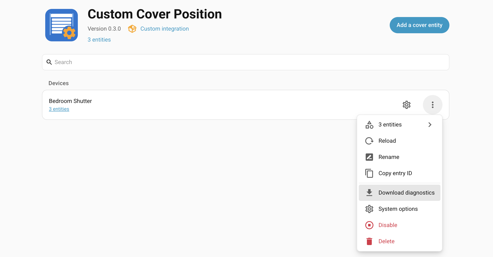

## Limites

- **La position est une estimation.** Rien ne la mesure : elle peut dériver (télécommande, vent, usure du moteur), et il faut parfois la recaler.
- **Les temps de réponse comptent.** Avec une intégration passant par un service en ligne, la commande peut arriver avec un léger retard. L'intégration démarre son décompte au moment où l'ordre est accepté.
- **L'inclinaison des lames n'est pas gérée** (store vénitien ou pergola à lames).
- **Une seule entité personnalisée par entité source.** Une entité source qui n'a pas d'identifiant unique dans Home Assistant ne peut être ni renommée, ni masquée, ni désactivée : l'échange des noms n'a pas lieu pour elle.
- **8 positions prédéfinies au maximum** par entité.
- **Un groupe ne contient que des entités personnalisées**, pas d'autre groupe ni d'entité source seule.

## Langues et documentation

L'intégration est traduite en **français et en anglais**. Elle s'affiche dans la langue choisie dans Home Assistant ; pour toute autre langue, elle s'affiche en anglais. Quelques éléments restent en anglais quelle que soit la langue : le fichier de diagnostic, et ce qui vient de Home Assistant ou de l'intégration de l'appareil source. Cette documentation existe en **français** (ce fichier) et en [**anglais**](README.md). Les captures d'écran sont en anglais.

## Licence et crédits

MIT. Merci à [davidramosweb](https://github.com/davidramosweb/home-assistant-custom-components-cover-time-based) et à [Sese-Schneider](https://github.com/Sese-Schneider/ha-cover-time-based) : leurs intégrations ont inspiré celle-ci.
